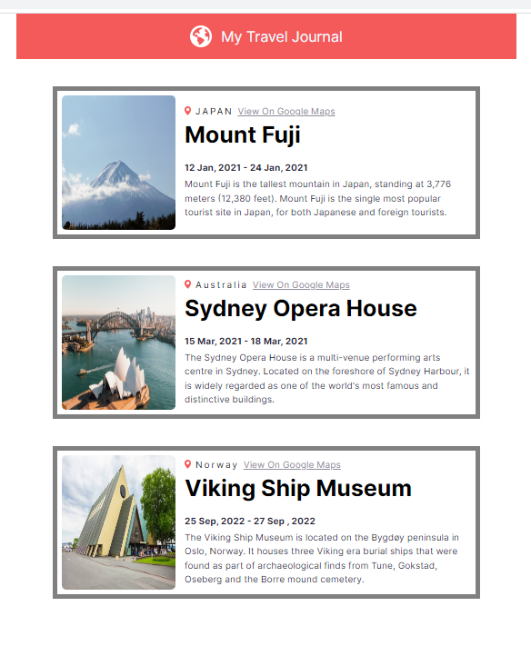

# Travel Journal [December 2nd 2022]

This project is one of the React solo projects from [Scrimba](https://scrimba.com/).

## Table of contents

- [Overview](#overview)
  - [Screenshot](#screenshot)
  - [Links](#links)
  - [Features](#features)
- [My process](#my-process)
  - [Built with](#built-with)
  - [What I learned](#what-i-learned)
  - [Continued development](#continued-development)
  - [Useful resources](#useful-resources)
- [Author](#author)
- [Acknowledgments](#acknowledgments)

## Overview

In this project, the goal was to build out a travel journal page using React. The main challenge was to map through some data, pass that data through props and render compenents on the page.

### Screenshots

### Links

- Live Site URL: [Travel Journal](https://regal-sopapillas-e4a680.netlify.app/)

### Features

- Displays components on the page via props.

## My process

I started by looking at figma files and writing down the possible routes I can take in terms of setting up my files. I then strctured my HTML file, then i used the figma file to get the appropriate colors and sizing to set up my CSS file. Some of the logic that went into the Javascript file was apart of the challenge but most of it was me adding my own logic in an effort to make it trully my creation.

### Built with

- HTML
- CSS
- Javascript
- React

### What I learned

I learned more about props and the way the work and also gained more knowlage about file structure when it comes to react.

### Continued development

The code will need additional refactoring to make it cleaner and more DRY.

### Useful resources

- [Scrimba](https://scrimba.com//)

## Author

- Jaron Denzel Young

## Acknowledgments

Thank you, Scrimba, for being an awesome place to learn.
